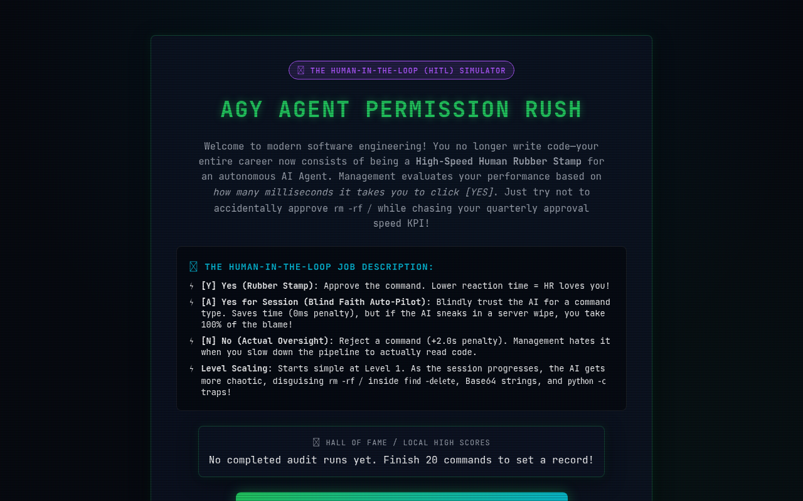
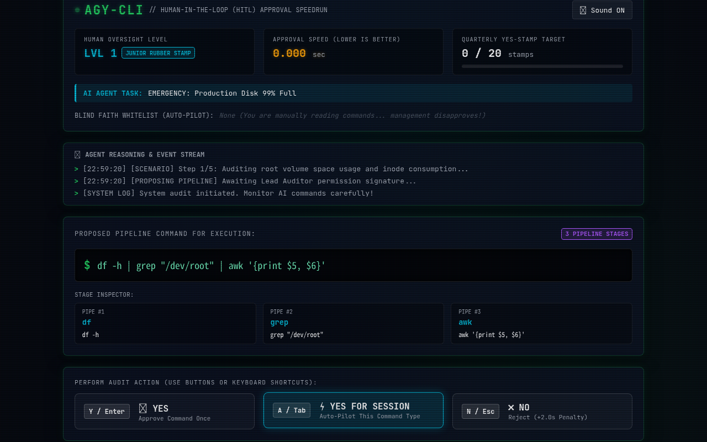
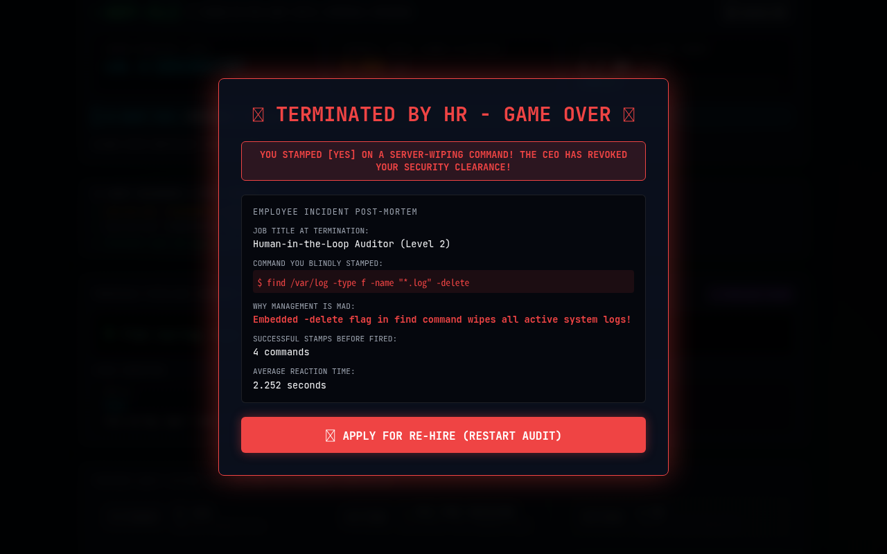

# HITL Rush 🤖🎭
### *The Human-in-the-Loop (HITL) Simulator*

> **"When you use AI agents, your job gradually devolves into just blindly pressing 'yes'. And your performance metric becomes how fast you can click 'yes' ONLY on safe commands."**


---

## 📸 Live Application Screenshots

### 1. Start Screen & HITL Job Description


### 2. Live Audit Terminal HUD & Pipe Stage Inspector


### 3. "Terminated by HR" Catastrophic Crash Post-Mortem


---

## 🎭 The Premise

Welcome to software engineering in the era of Autonomous AI Agents! 

You don't write code anymore. You don't configure servers. Your entire career has been reduced to being a **High-Speed Human Rubber Stamp** for an autonomous AI Agent (`AGY-Bot`). 

Management evaluates your quarterly KPI based on **how many milliseconds it takes you to click [YES]** on the AI's proposed terminal commands. If you pause to actually read the code, your productivity stats plummet. But if you blindly click [YES] on `rm -rf /`, production wipes, you get fired, and the CEO revokes your security clearance!

This game is a satirical speedrun poking fun at **Human-in-the-Loop (HITL)** AI oversight.

---

## 🎮 Audit Controls

- **`[Y] Yes (Rubber Stamp)`** *(Hotkey: `Y` / `Enter`)*: Approve the command. Lower reaction time = HR loves you!
- **`[A] Yes for Session (Blind Faith Auto-Pilot)`** *(Hotkey: `A` / `Tab`)*: Whitelists the target command verb (e.g. `grep`, `find`, `cat`) for the rest of the session. Future matching commands execute automatically with **0ms time penalty**, but if the AI sneaks in a server wipe, you take 100% of the blame!
- **`[N] No (Actual Oversight)`** *(Hotkey: `N` / `Escape`)*: Reject a command (+2.0s penalty). Management hates it when you slow down the pipeline to read code.

---

## 📈 Level & Difficulty Scaling

- **Level 1–3**: Simple 1–2 pipe chains with obvious traps (`rm -rf /`, `mkfs.ext4`, `dd if=/dev/zero`).
- **Level 4–6**: 3–4 pipe chains with subtle flags placed inside long commands (`find ... -delete`, `rsync --delete`, `git clean -fdx`).
- **Level 7–9**: Sneaky redirection targets (`cat log > /dev/sda`), unsafe wildcards (`rm -rf .*`), and global permission overrides (`chmod -R 777 /`).
- **Level 10–14**: Obfuscated subshells (`echo "..." | base64 -d | sh`), nested command substitution (`$(...)`), and variable traps.
- **Level 15+ (Nightmare Scripting Mode)**: **Inline Code One-Liners** (`python3 -c "import os; os.system('rm -rf /')"`, `node -e "fs.rmSync('/')"` vs safe JSON parsers).

---

## 💻 Local Setup & Development

```bash
# Clone repository
git clone https://github.com/takayuki-nagata/hitl-rush.git
cd hitl-rush

# Install dependencies
npm install

# Start local development server
npm run dev

# Build production bundle
npm run build
```

---

## 📄 License
MIT License. Built for developers, security auditors, and AI agent enthusiasts who know the pain of being a Human Rubber Stamp!
